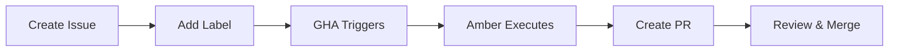

# Amber Issue-to-PR Automation

## Overview

Amber is a background agent that automatically handles GitHub issues and creates pull requests. This system allows team members to trigger automated fixes, refactoring, and test additions without requiring direct access to Claude Code.

## How It Works



1. **Create Issue**: Team member creates an issue using one of the Amber templates
2. **Add Label**: Apply appropriate label (`amber:auto-fix`, `amber:refactor`, `amber:test-coverage`)
3. **GHA Triggers**: GitHub Actions workflow detects label and starts Amber
4. **Amber Executes**: Amber analyzes the issue and makes changes
5. **Create PR**: Amber creates a pull request with the changes
6. **Review & Merge**: Team reviews and merges the PR

## Available Workflows

### 🤖 Auto-Fix (Low Risk)

**Trigger Label**: `amber:auto-fix`

**Use For**:
- Code formatting (gofmt, black, prettier)
- Linting violations
- Unused import removal
- Documentation formatting

**Template**: `.github/ISSUE_TEMPLATE/amber-auto-fix.yml`

**Example**:
```yaml
Title: [Amber] Fix frontend linting errors
Label: amber:auto-fix
Body:
  Issue: Frontend code fails eslint checks
  Files: components/frontend/src/**/*.tsx
  Fix Type: Linting Violations
```

**Expected Outcome**: PR with automated formatting/linting fixes, all tests pass

---

### 🔧 Refactoring (Medium Risk)

**Trigger Label**: `amber:refactor`

**Use For**:
- Breaking large files into modules
- Extracting repeated patterns
- Replacing `context.TODO()` with proper context
- Improving error handling

**Template**: `.github/ISSUE_TEMPLATE/amber-refactor.yml`

**Example**:
```yaml
Title: [Amber Refactor] Break sessions.go into modules
Label: amber:refactor
Body:
  Current State: handlers/sessions.go is 3,495 lines
  Desired State: Break into lifecycle.go, status.go, jobs.go, validation.go
  Constraints: Maintain backward compatibility, all tests pass
  Priority: P0
```

**Expected Outcome**: PR with refactored code, detailed migration notes, all tests pass

---

### 🧪 Test Coverage (Medium Risk)

**Trigger Label**: `amber:test-coverage`

**Use For**:
- Adding missing unit tests
- Contract tests for API endpoints
- Edge case coverage
- Improving test coverage percentage

**Template**: `.github/ISSUE_TEMPLATE/amber-test-coverage.yml`

**Example**:
```yaml
Title: [Amber Tests] Add contract tests for sessions API
Label: amber:test-coverage
Body:
  Untested Code: components/backend/handlers/sessions.go
  Test Type: Contract Tests (API endpoints)
  Test Scenarios:
    - Happy path: create session with valid spec
    - Error: missing API key
    - Edge case: very long prompt
  Target Coverage: 60%
```

**Expected Outcome**: PR with new tests following project conventions (table-driven for Go)

---

## Advanced Usage

### Manual Trigger via Comment

You can trigger Amber by commenting on an existing issue using either:

```
/amber execute
```

Or simply mention Amber:

```
@amber
```

Both commands tell Amber to execute the proposal described in the issue body. Amber will read the full issue context and determine the appropriate action.

**Use Cases**:
- After discussing a refactoring approach in an issue, comment `@amber` to have Amber implement it
- Quick fixes without needing to add labels: `@amber please fix the linting errors in this file`
- Code review requests: `@amber review this approach and suggest improvements`

---

### Issue Format Requirements

For Amber to work effectively, structure your issue body like this:

```markdown
## Problem
[Describe what needs to be fixed]

## Files
File: `path/to/file.go`
File: `path/to/another.py`

## Instructions
[Step-by-step instructions for Amber]

## Success Criteria
- [ ] All linters pass
- [ ] All tests pass
- [ ] Follows CLAUDE.md standards
```

**Key Fields**:
- `File:` or `Path:` - Amber extracts file paths automatically
- `Instructions:` or `Task:` - Main instructions section
- Success criteria checklist

---

## Configuration

Amber's behavior is controlled by:

1. **Workflow**: `.github/workflows/amber-issue-handler.yml`
2. **Config**: `.claude/amber-config.yml` (automation policies)
3. **Project Standards**: `CLAUDE.md` (Amber follows all project conventions)

### Risk Levels

Amber classifies changes by risk:

| Risk | Actions | Auto-Merge | Examples |
|------|---------|------------|----------|
| **Low** | Auto-fix, create PR | No (requires review) | Formatting, linting |
| **Medium** | Create PR with proposal | No | Refactoring, test additions |
| **High** | Report only, no PR | N/A | Breaking changes, security issues |

---

## Security

The workflow follows **strict security practices**:

1. **No Command Injection**: All user input (issue titles, bodies) passed via environment variables
2. **Token Scoping**: `GITHUB_TOKEN` has minimal permissions (contents:write, issues:write, pull-requests:write)
3. **Anthropic API Key**: Stored as GitHub secret (`ANTHROPIC_API_KEY`)
4. **Branch Protection**: Never pushes to `main`, always creates feature branches

**Reference**: [GitHub Actions Security Guide](https://github.blog/security/vulnerability-research/how-to-catch-github-actions-workflow-injections-before-attackers-do/)

---

## Monitoring

### View Workflow Runs

```bash
# Via GitHub CLI
gh run list --workflow=amber-issue-handler.yml

# Watch specific run
gh run watch <run-id>

# View logs
gh run view <run-id> --log
```

### Amber-Generated PRs

All PRs created by Amber have:
- **Title**: `[Amber] Fix: <issue title>`
- **Labels**: `amber-generated`, `auto-fix`, `<action-type>`
- **Body**: Detailed summary with links back to original issue

---

## Troubleshooting

### Amber Workflow Didn't Trigger

**Possible Causes**:
1. Wrong label applied (must be exact: `amber:auto-fix`, not `amber auto-fix`)
2. Issue not in correct repository
3. `ANTHROPIC_API_KEY` secret not configured

**Debug**:
```bash
gh run list --workflow=amber-issue-handler.yml --limit 5
```

---

### Amber Created PR but Tests Failed

**Expected Behavior**: Amber runs linters/tests before committing, but CI may have additional checks.

**Actions**:
1. Review PR, identify failing test
2. Add comment to PR: `/amber fix-tests`
3. Amber will update the PR with fixes

**Alternative**: Close PR, update original issue with additional context, re-trigger Amber

---

### Amber Encountered Error

Amber will comment on the issue with error details:

```
⚠️ Amber encountered an error while processing this issue.

**Action Type:** refactor
**Workflow Run:** [link to logs]

Please review the workflow logs for details.
```

**Common Issues**:
- Issue description lacks sufficient context
- Specified files don't exist
- Changes too complex for automation (requires manual intervention)

---

## Best Practices

### ✅ Good Issue Examples

**Auto-Fix**:
```markdown
Title: [Amber] Fix Go formatting in backend handlers
Label: amber:auto-fix

## Problem
Backend handlers fail gofmt checks after recent commits.

## Files
File: `components/backend/handlers/*.go`

## Fix Type
Code Formatting
```

**Refactoring**:
```markdown
Title: [Amber Refactor] Extract git operations from sessions.go
Label: amber:refactor

## Current State
File: `components/backend/handlers/sessions.go` (line 1200-1800)
Issue: Git operations mixed with session handling logic

## Desired State
Create new file: `components/backend/git/session_operations.go`
Move git clone, fork, PR creation functions

## Constraints
- Maintain current API (no breaking changes)
- Add unit tests for extracted functions
- All existing tests must pass
```

**Test Coverage**:
```markdown
Title: [Amber Tests] Add contract tests for Projects API
Label: amber:test-coverage

## Untested Code
File: `components/backend/handlers/projects.go`
Functions: CreateProject, DeleteProject, ListProjects

## Test Scenarios
- Happy path: create project with valid name
- Error: create project with duplicate name
- Error: create project with invalid characters
- Edge: list projects when none exist

## Target Coverage
60% for projects.go
```

---

### ❌ Avoid These Patterns

**Too Vague**:
```markdown
Title: Fix stuff
Label: amber:auto-fix

Make the code better.
```
*Issue*: No specific files, instructions, or success criteria

**Too Broad**:
```markdown
Title: Refactor entire backend
Label: amber:refactor

Rewrite all backend code to be perfect.
```
*Issue*: Scope too large, no clear boundaries

**Security Risk**:
```markdown
Title: Update API keys in code
Label: amber:auto-fix

Hardcode new API keys in handlers.
```
*Issue*: Amber will refuse (security violation)

---

## Extending Amber

### Adding New Workflow Types

1. **Update workflow** (`.github/workflows/amber-issue-handler.yml`):
   ```yaml
   if: |
     github.event.label.name == 'amber:your-new-type'
   ```

2. **Create issue template** (`.github/ISSUE_TEMPLATE/amber-your-type.yml`)

3. **Update config** (`.claude/amber-config.yml`):
   ```yaml
   automation_policies:
     your_new_type:
       enabled: true
       categories:
         - name: "Your New Type"
           patterns: ["pattern1", "pattern2"]
   ```

4. **Document** in this file

---

## Metrics & Reporting

Track Amber's effectiveness:

```bash
# Count Amber-generated PRs
gh pr list --label amber-generated --state all

# Amber success rate (merged vs. closed)
gh pr list --label amber-generated --state merged | wc -l
gh pr list --label amber-generated --state closed | wc -l

# Average time from issue creation to PR merge
# (requires custom script or GitHub API)
```

**Goal**: 90% of Amber PRs merged without modification

---

## FAQ

**Q: Can Amber handle multiple files in one PR?**
A: Yes, specify multiple files in the issue body. Amber will modify all relevant files.

**Q: Can I trigger Amber without an issue?**
A: No, issues provide context and audit trail. For ad-hoc tasks, create a temporary issue.

**Q: What happens if Amber's PR conflicts with other work?**
A: Standard git conflict resolution. Review the PR, resolve conflicts manually, or close and re-trigger after merging other work.

**Q: Can Amber create breaking changes?**
A: No, Amber is configured to reject breaking changes. It will comment on the issue if it detects a breaking change request.

**Q: How much does Amber cost (API usage)?**
A: Depends on task complexity. Typical auto-fix: ~10K tokens ($0.03), refactoring: ~50K tokens ($0.15), test coverage: ~30K tokens ($0.09). Monitor via Anthropic dashboard.

---

## Related Documentation

- [Amber Configuration](https://github.com/ambient-code/platform/blob/main/.claude/amber-config.yml) - Automation policies
- [Project Standards](https://github.com/ambient-code/platform/blob/main/CLAUDE.md) - Conventions Amber follows
- [GitHub Actions Security](https://docs.github.com/en/actions/security-for-github-actions) - Official security guide

---

## Support

**Issues with Amber automation**:
1. Check workflow logs: `gh run view --log`
2. Review issue format requirements (above)
3. Create issue with label `amber:help` for manual review

**Feature Requests**:
Create issue titled `[Amber Feature Request] ...` describing desired capability.

---

**Last Updated**: 2025-11-21
**Maintained By**: Platform Team
