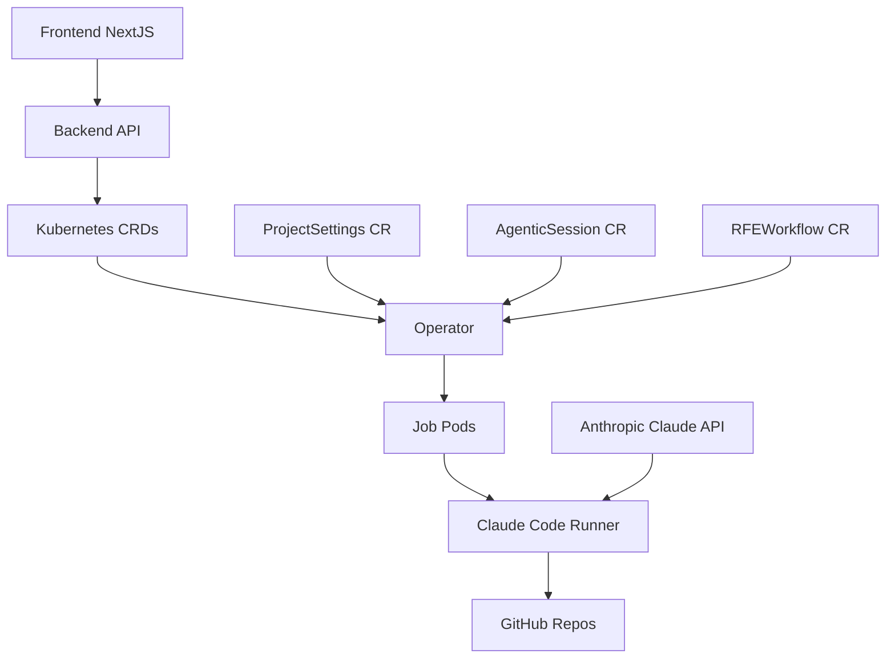

# Developer Guide

Welcome to the vTeam Developer Guide! This section provides comprehensive information for developers who want to contribute to, extend, or deeply understand the vTeam system.

## What You'll Learn

This guide covers technical implementation details and development workflows:

### 🔧 [Setup](setup.md)

- Development environment configuration
- Dependencies and tooling
- Local development workflow

### 🏗️ [Architecture](architecture.md)

- System design and component overview
- LlamaDeploy workflow orchestration
- Multi-agent coordination patterns

### 🔌 [Plugin Development](plugin-development.md)

- Creating custom agent personas
- Extending workflow capabilities
- Integration patterns and APIs

### 📚 [API Reference](api-reference.md)

- REST endpoint documentation
- Python API usage examples
- Response schemas and error codes

### 🤝 [Contributing](contributing.md)

- Code standards and review process
- Testing requirements and strategies
- Documentation guidelines

### 🧪 [Testing](testing.md)

- Unit testing strategies
- Integration testing with AI services
- Performance testing and benchmarks

## Developer Personas

This guide serves different development roles:

### **Backend Engineers**

Focus on LlamaDeploy workflows, agent orchestration, and API development.

### **Frontend Engineers**

Learn about the TypeScript chat interface and @llamaindex/server integration.

### **DevOps Engineers**

Understand deployment architecture, monitoring, and scalability considerations.

### **AI/ML Engineers**

Explore agent behavior customization, prompt engineering, and model integration.

### **QA Engineers**

Discover testing strategies for AI-powered workflows and integration patterns.

## Technology Stack

Understanding our core technologies:

### **Backend (Go)**

- **Gin**: HTTP server and routing
- **Kubernetes Client**: Interacts with CRDs and cluster APIs
- **GitHub App Integration**: Installation tokens, repo proxying

### **Operator (Go)**

- **Controller Runtime**: Watches CRDs and manages Jobs
- **Runner Orchestration**: Creates per-session runner pods with PVC

### **Frontend (TypeScript/Next.js)**

- **Next.js + React**: UI and routing
- **Shadcn UI**: Component library
- **WebSocket**: Real-time session updates

### **Runner (Python)**

- **Claude Code SDK**: Executes agentic sessions
- **Multi-agent collaboration**: Supports complex workflows

### **AI Integration**

- **Anthropic Claude**: Primary model via Claude Code SDK

### **Development Tools**

- **docker/podman**: Container builds
- **make**: Build and deploy automation
- **Kubernetes/OpenShift**: Runtime platform

## Architecture Overview



## Development Workflow

### Quick Start for Contributors

1. **Fork and clone** the repository
2. **Set up development environment** following [Setup Guide](setup.md)
3. **Choose your area** - backend Python, frontend TypeScript, or documentation
4. **Read the contributing guidelines** in [Contributing](contributing.md)
5. **Start with a good first issue** labeled `good-first-issue`

### Code Organization

```
vTeam/
├── components/
│   ├── backend/                # Go REST API
│   │   ├── handlers.go         # HTTP handlers
│   │   ├── git.go              # GitHub integration
│   │   └── websocket_messaging.go # Real-time updates
│   ├── frontend/               # Next.js web UI
│   │   ├── app/                # Next.js app router
│   │   └── components/         # React components
│   ├── operator/               # Kubernetes operator (Go)
│   │   └── controllers/        # CR reconciliation logic
│   ├── runners/
│   │   └── claude-code-runner/ # Python Claude Code SDK wrapper
│   └── manifests/              # Kubernetes deployment YAMLs
│       ├── crds/               # Custom Resource Definitions
│       └── deployment/         # Deployment manifests
└── docs/                       # Documentation (you are here!)
```

## Key Development Areas

### **Custom Resource Development**

Extend the Kubernetes CRD system with new workflow types and orchestration patterns.

### **Operator Enhancement**

Improve reconciliation loops, job management, and error handling in the operator.

### **Runner Capabilities**

Enhance the Claude Code runner with new tools and integration patterns.

### **API & Integration Development**

Build new integrations, improve existing APIs, and enhance external service connections.

### **Frontend Experience**

Improve the chat interface, add visualization features, and enhance user experience.

## Getting Started

Choose your path based on your interests:

- **New to the codebase?** → Start with [Setup Guide](setup.md)
- **Want to understand the system?** → Read [Architecture](architecture.md)
- **Ready to build features?** → Check [Plugin Development](plugin-development.md)
- **Looking to contribute?** → Review [Contributing Guidelines](contributing.md)
- **Need API details?** → Explore [API Reference](api-reference.md)

## Quality Standards

We maintain high standards for code quality:

- **Test Coverage**: Minimum 80% for new code
- **Type Safety**: Full mypy compliance for Python
- **Code Style**: Automated formatting with black/isort
- **Documentation**: Comprehensive docstrings and examples
- **Performance**: Sub-5-second agent response times

## Community

Connect with other developers:

- **GitHub Discussions**: Technical questions and design decisions
- **Issue Tracker**: Bug reports and feature requests  
- **Pull Request Reviews**: Code collaboration and feedback
- **Documentation**: Help improve this developer guide

Let's build the future of AI-assisted software refinement together! 🚀
