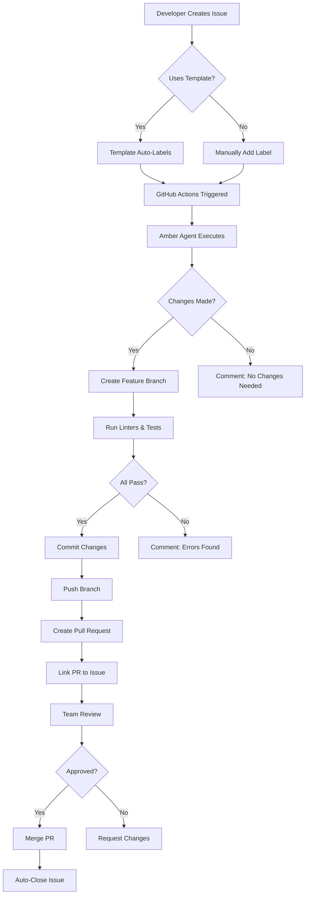
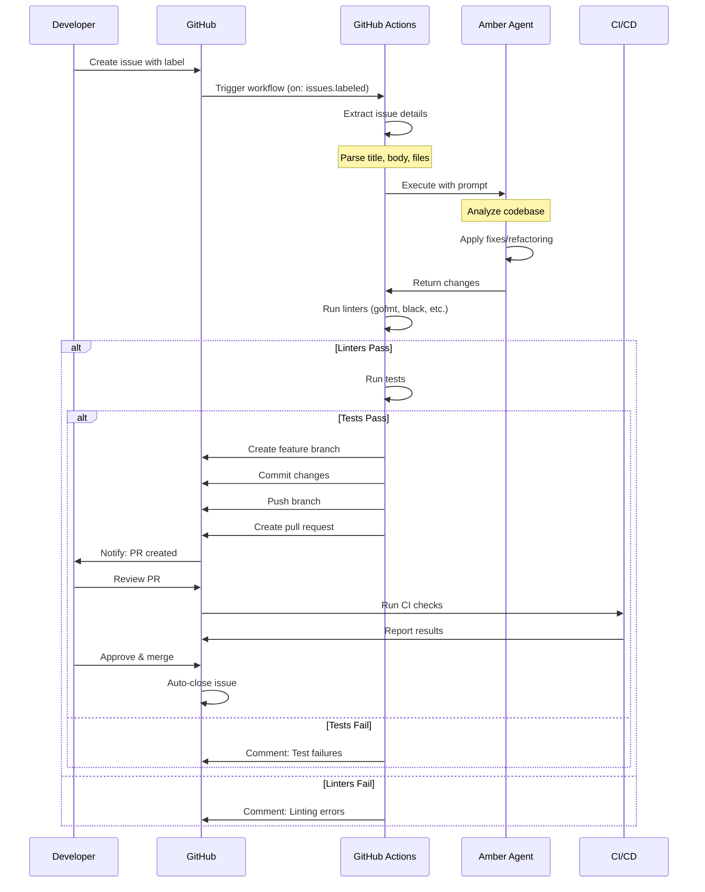
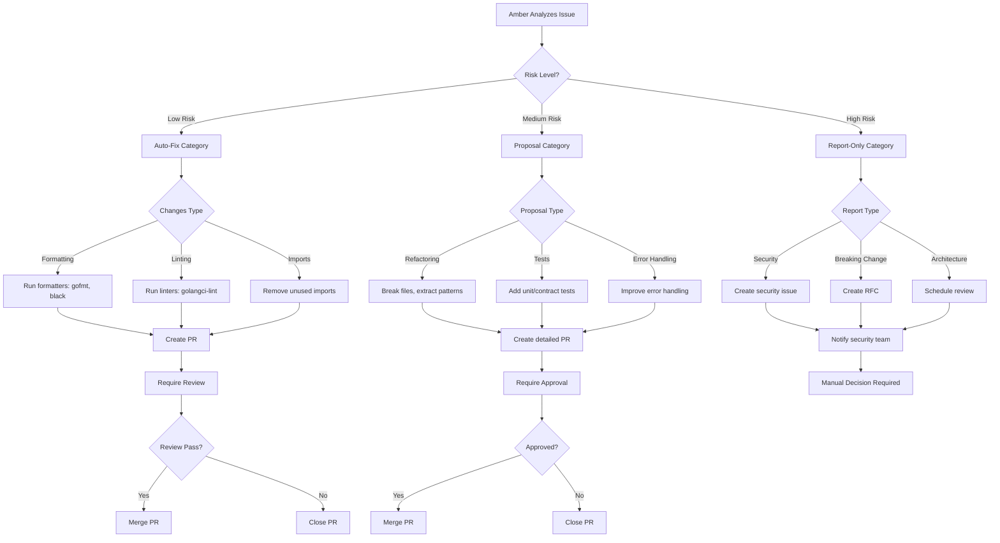
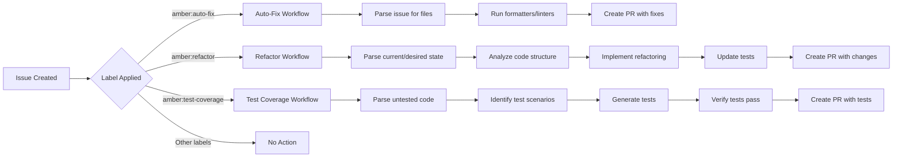
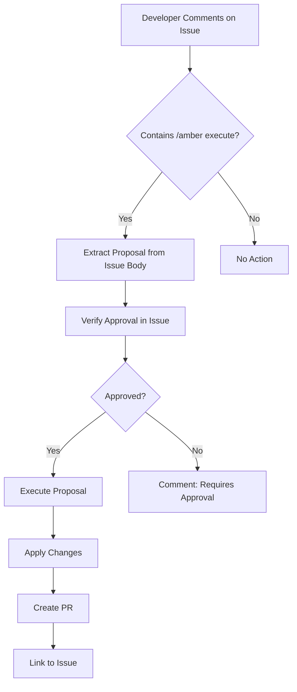
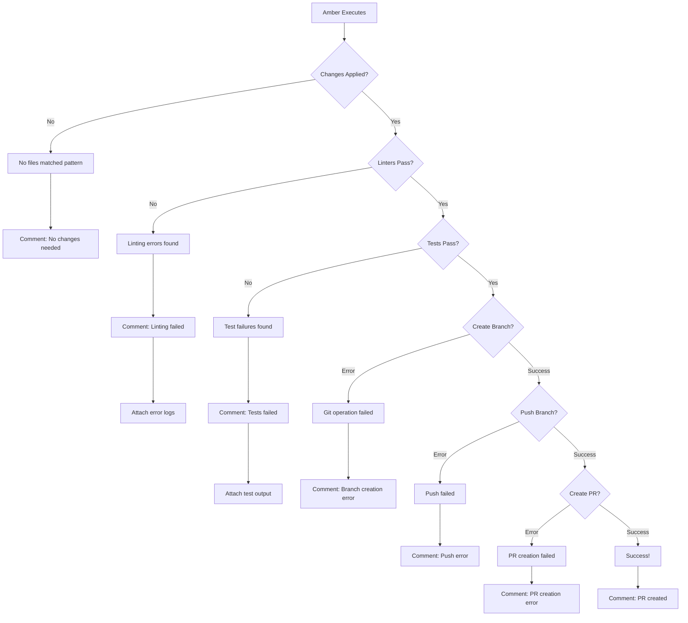
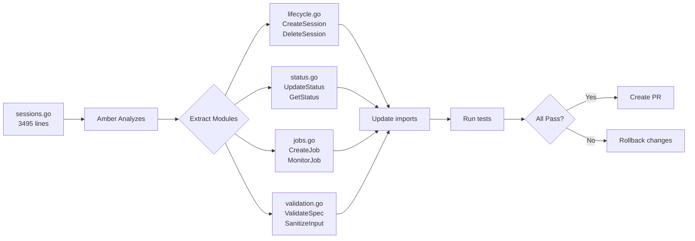
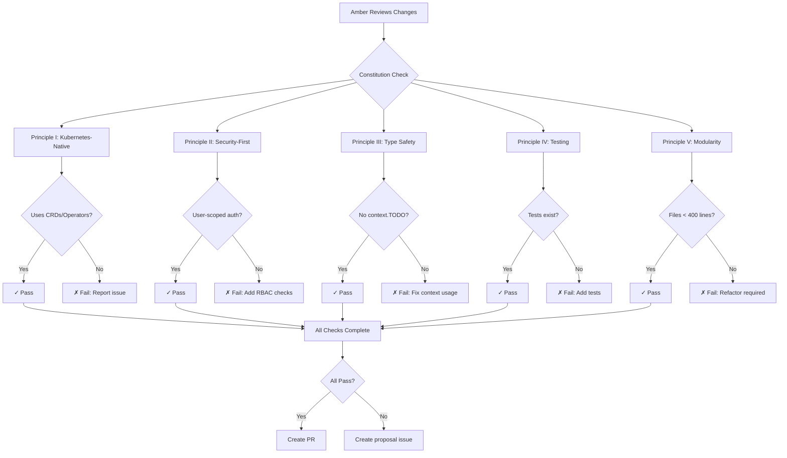
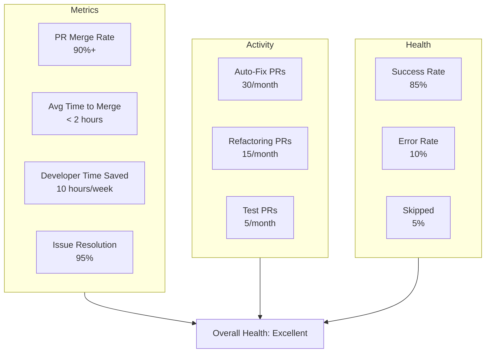
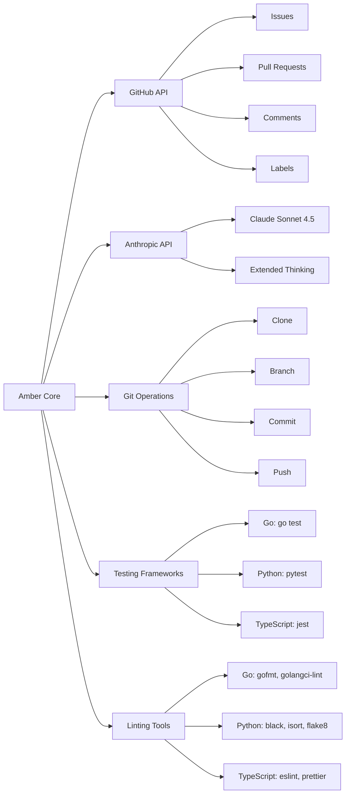

# Amber Issue-to-PR Workflow Diagrams

## High-Level Flow

## Detailed Workflow Steps

## Risk-Based Decision Tree

## Label-Triggered Workflows

## Comment-Triggered Workflow

## Error Handling Flow

## Multi-File Refactoring Example

## Constitution Compliance Check

## Monitoring Dashboard (Conceptual)

## Integration Points

---

## Legend

- **Rectangle**: Process/Action
- **Diamond**: Decision Point
- **Oval**: Start/End State
- **Parallelogram**: Input/Output
- **Solid Arrow**: Sequential Flow
- **Dashed Arrow**: Conditional Flow
