# Working with Amber - Your AI Pair Programmer

## Introduction

Amber is the Ambient Code Platform's AI colleague—an expert in your codebase who works alongside you in multiple modes. Whether you need on-demand consultation, autonomous backlog management, or proactive maintenance, Amber adapts to how you work.

**Operating Modes:**

1. **Interactive Consultation** - On-demand expertise via UI or `@amber` mentions
2. **Background Agent** - Autonomous issue-to-PR workflows and backlog reduction
3. **Sprint Planning** - Automated backlog analysis and planning reports
4. **Maintainer Mode** - PR reviews and codebase health monitoring *(Coming Soon)*

**When to use Amber:** Whenever you're working with the `github.com/ambient-code/platform` codebase. Amber is your expert colleague for all ACP platform development, maintenance, and operations.

## Quick Start

**Try Amber:**

1. Open your ACP project in the UI
2. Navigate to **Sessions** → **New Session**
3. Select **Amber** from the agent dropdown
4. Enter: `"Amber, what are the main components of ACP?"`
5. Click **Start Session**

**Pro tip:** Use `@amber` in interactive sessions to invoke her in chat.

**Note:** Amber follows the ACP Constitution absolutely. She'll decline requests that violate project principles and explain why. See "Understanding Amber's Authority" below for details.

---

## Amber's Capabilities

| Category | What Amber Does |
|----------|----------------|
| **Codebase Intelligence** | Deep knowledge of architecture, patterns (CLAUDE.md, DESIGN_GUIDELINES.md), dependencies (K8s, Claude SDK, OpenShift, Go, NextJS, Langfuse), common issues |
| **Proactive Maintenance** | Monitors upstream for breaking changes, scans dependencies, detects issue patterns, generates health reports |
| **Autonomy Levels** | Level 1: Read-only analysis; Level 2: Creates PRs for review; Level 3: Auto-merges low-risk changes; Level 4: Full autonomy (future) |

## How to Invoke Amber

### On-Demand via UI

1. Navigate to **Projects** → **[Your Project]** → **Sessions**
2. Click **New Session**
3. Select **Amber (Codebase Colleague)** from agent dropdown
4. Enter your prompt
5. Click **Start Session**

### On-Demand via kubectl

```yaml
apiVersion: vteam.ambient-code/v1alpha1
kind: AgenticSession
metadata:
  name: amber-analysis
  namespace: your-project
spec:
  prompt: |
    Amber, analyze changes from the past week and identify:
    1. Dependency updates that may have breaking changes
    2. New patterns introduced that might need documentation
    3. Potential security concerns from recent commits
  repos:
    - input:
        url: https://github.com/your-org/platform
        branch: main
  interactive: false
  timeout: 600
```

Apply: `kubectl apply -f amber-session.yaml`

Monitor: `kubectl get agenticsession amber-analysis -n your-project -w`

### Visual Workflow: Interactive Consultation

```mermaid
sequenceDiagram
    participant U as User
    participant UI as ACP UI
    participant A as Amber

    U->>UI: Create AgenticSession
    U->>UI: Enter prompt/question
    UI->>A: Start session
    A->>A: Analyze codebase context
    A->>A: Generate response with<br/>file:line references
    A->>UI: Return analysis

    rect rgb(255, 230, 230)
        Note over U,UI: ⚠️ HUMAN REVIEW
        UI->>U: Display response with<br/>confidence level
        U->>U: Review recommendation
    end

    alt Accept Recommendation
        rect rgb(255, 230, 230)
            Note over U: ⚠️ HUMAN DECISION
            U->>U: Implement suggested action
        end
    else Need More Information
        U->>UI: Ask follow-up question
        UI->>A: Continue session
        A->>UI: Provide additional context
    else Reject/Close
        U->>UI: End session
    end
```



**Key Points:**

- User initiates and controls the entire workflow
- Amber provides analysis with confidence levels (High 90-100%, Medium 70-89%, Low <70%)
- Human review required before any action
- Interactive back-and-forth supported

## Understanding Amber's Authority

Amber operates within a clear hierarchy to ensure quality and compliance:

| Priority | What | Authority | Notes |
|----------|------|-----------|-------|
| **1** | **ACP Constitution** | Absolute | Amber cannot violate constitution principles, even if you ask |
| **2** | **CLAUDE.md** | High | Project standards; negotiable with your approval |
| **3** | **Amber's Expertise** | Medium | ACP-specific guidance within constitutional bounds |
| **4** | **Your Instructions** | Variable | Must align with constitution and project standards |

**What This Means for You:**

✅ **Amber will decline**: Requests that violate the constitution (e.g., "skip tests", "use panic()", "commit without linting")

⚠️ **Amber will warn**: Deviations from CLAUDE.md preferences (e.g., "docker instead of podman") but proceed if you confirm

✅ **Amber will implement**: Your task requirements within constitutional and project compliance

**Example:**
- You: "Just commit this without running tests, I'm in a hurry"
- Amber: "I cannot skip tests - Constitution Principle IV requires TDD. I can help you write minimal tests quickly to unblock the commit. Would that work?"

## Background Agent Mode

Amber can operate autonomously to manage your backlog and prevent issue accumulation:

### Issue-to-PR Workflow

**Automatic Issue Triage (GitHub Webhook):**
```yaml
# Webhook creates AgenticSession on issue creation
apiVersion: vteam.ambient-code/v1alpha1
kind: AgenticSession
metadata:
  name: amber-triage-{{ issue.number }}
  namespace: your-project
spec:
  prompt: |
    Triage issue #{{ issue.number }}:
    1. Assess severity and affected components
    2. Find related issues or patterns
    3. Auto-fix if < 30min high-confidence work, or
    4. Add analysis comment and suggest assignee
  repos:
    - input:
        url: https://github.com/your-org/platform
        branch: main
      output:
        targetBranch: amber/fix-issue-{{ issue.number }}
  autoPushOnComplete: conditional  # Only if auto-fix attempted
```

**Safety Gates:**
- **TodoWrite checkpoint**: Amber shows detailed plan before implementing fix
- **Human approval required**: Session results display plan, user confirms via UI before PR creation
- **Dual review**: (1) Plan review in session + (2) PR review in GitHub

**Backlog Reduction (Scheduled):**
```yaml
apiVersion: batch/v1
kind: CronJob
metadata:
  name: amber-backlog-reducer
  namespace: your-project
spec:
  schedule: "0 */4 * * *"  # Every 4 hours
  jobTemplate:
    spec:
      template:
        spec:
          serviceAccountName: your-project-sa
          containers:
            - name: trigger-amber
              image: registry.k8s.io/kubectl:latest
              command:
                - /bin/sh
                - -c
                - |
                  cat <<EOF | kubectl apply -f -
                  apiVersion: vteam.ambient-code/v1alpha1
                  kind: AgenticSession
                  metadata:
                    name: amber-backlog-$(date +%Y%m%d-%H)
                    namespace: your-project
                  spec:
                    prompt: |
                      Work through backlog:
                      1. Find oldest good-first-issue or technical-debt labeled issue
                      2. If auto-fixable in <30min, create PR with detailed context
                      3. Use TodoWrite to show plan before executing
                      4. Include rollback instructions in PR description
                    repos:
                      - input:
                          url: https://github.com/your-org/platform
                          branch: main
                        output:
                          targetBranch: amber/backlog-fix-$(date +%Y%m%d-%H)
                    autoPushOnComplete: true
                  EOF
          restartPolicy: Never
```

**Safety Gates in This CronJob:**
```yaml
spec:
  prompt: |
    # ... existing prompt ...
    3. Use TodoWrite to show plan before executing  # 👈 SAFETY GATE
    4. Include rollback instructions in PR description
```

**Why This Matters:**
- TodoWrite creates a visible checkpoint showing what Amber will do
- User can review the plan in the AgenticSession UI before approval
- No code changes happen until plan is confirmed
- Every PR includes rollback instructions for safety

### Key Benefits

- **Prevents backlog growth**: Triages issues immediately upon creation
- **Reduces existing backlog**: Tackles auto-fixable issues systematically
- **24/7 operation**: Works continuously without human intervention
- **Pattern detection**: Identifies related issues before they multiply
- **Knowledge preservation**: Documents decisions in PR descriptions

### Visual Workflow: Background Agent Mode (Issue-to-PR)

```mermaid
sequenceDiagram
    participant GH as GitHub
    participant A as Amber
    participant U as Human Reviewer

    GH->>A: Issue Created Event (Webhook)
    A->>A: Triage Issue
    A->>A: Assess severity & components
    A->>A: Check auto-fixability<br/>(< 30min + high confidence?)

    alt High Confidence Auto-Fix
        A->>A: Use TodoWrite<br/>(Show detailed plan)
        rect rgb(255, 230, 230)
            Note over A,U: ⚠️ HUMAN CHECKPOINT
            A->>U: Display plan in session
            U->>A: Review & approve plan
        end
        A->>GH: Create PR with fix
        Note over GH: PR includes:<br/>- Detailed context<br/>- Rollback instructions<br/>- Confidence level
        rect rgb(255, 230, 230)
            Note over GH,U: ⚠️ HUMAN REVIEW REQUIRED
            U->>GH: Review PR
            U->>GH: Merge or request changes
        end
    else Needs Investigation
        A->>GH: Add analysis comment
        A->>GH: Suggest assignee
        rect rgb(255, 230, 230)
            Note over GH,U: ⚠️ HUMAN DECISION
            U->>GH: Assign to developer<br/>or take action
        end
    end
```



**Key Points:**

- TodoWrite safety gate ensures plan visibility before action
- Dual checkpoint system: Plan review + PR review
- Escalation path for complex issues (human expertise required)
- Rollback instructions included in every PR
- Never auto-merges - always requires human PR review

### Scheduled (Automated Health Checks)

Create CronJobs to run Amber periodically:

**Nightly Health Check:**

```yaml
apiVersion: batch/v1
kind: CronJob
metadata:
  name: amber-nightly
  namespace: your-project
spec:
  schedule: "0 6 * * *"
  jobTemplate:
    spec:
      template:
        spec:
          serviceAccountName: your-project-sa
          containers:
            - name: trigger-amber
              image: registry.k8s.io/kubectl:latest
              command:
                - /bin/sh
                - -c
                - |
                  cat <<EOF | kubectl apply -f -
                  apiVersion: vteam.ambient-code/v1alpha1
                  kind: AgenticSession
                  metadata:
                    name: amber-health-$(date +%Y%m%d)
                    namespace: your-project
                  spec:
                    prompt: |
                      Run nightly health check:
                      1. Failed CI runs (past 24h)
                      2. Security alerts
                      3. Upstream breaking changes
                      4. Open P0/P1 issues
                      Store findings in session results (accessible via UI)
                    repos:
                      - input:
                          url: https://github.com/your-org/platform
                          branch: main
                        output:
                          targetBranch: amber/health-$(date +%Y-%m-%d)
                    autoPushOnComplete: true
                  EOF
          restartPolicy: Never
```

**No TodoWrite Needed Here:**
This is a read-only analysis workflow. Amber generates a report and commits it to a feature branch, then creates a PR. No direct code changes to main codebase, so TodoWrite checkpoint isn't required. The PR itself serves as the review gate.

**Weekly Sprint Planning:**

```yaml
apiVersion: batch/v1
kind: CronJob
metadata:
  name: amber-sprint-planner
  namespace: your-project
spec:
  schedule: "0 9 * * 1"  # Monday 9 AM
  jobTemplate:
    spec:
      template:
        spec:
          serviceAccountName: your-project-sa
          containers:
            - name: trigger-amber
              image: registry.k8s.io/kubectl:latest
              command:
                - /bin/sh
                - -c
                - |
                  cat <<EOF | kubectl apply -f -
                  apiVersion: vteam.ambient-code/v1alpha1
                  kind: AgenticSession
                  metadata:
                    name: amber-sprint-$(date +%Y-%W)
                    namespace: your-project
                  spec:
                    prompt: |
                      Generate sprint plan:
                      1. Cluster issues by theme
                      2. Identify related issues
                      3. Suggest priority order
                      4. Flag blockers
                      Create PR with analysis (viewable in GitHub UI)
                    repos:
                      - input:
                          url: https://github.com/your-org/platform
                          branch: main
                        output:
                          targetBranch: amber/sprint-$(date +%Y-%W)
                    autoPushOnComplete: true
                  EOF
          restartPolicy: Never
```

**No TodoWrite Needed Here:**
Similar to health checks, this is an analysis workflow. Amber creates a report in a feature branch and opens a PR. The team reviews the sprint plan via the PR before merging. No code execution, only planning analysis.

**When TodoWrite IS Required:**
- Modifying code (bug fixes, refactoring, features)
- Changing configuration (YAML, env vars, secrets)
- Database migrations or destructive operations
- Any changes to production-affecting resources

**When TodoWrite Is Optional:**
- Read-only analysis and reporting
- Documentation updates (non-critical)
- Creating planning documents (like sprint plans)

### Visual Workflow: Scheduled Health Checks / Sprint Planning


**Key Points:**

- Fully automated report generation (no human in loop)
- Creates PR for review - never commits to main
- Team reviews and validates before sprint adoption
- Can be modified before acceptance
- Weekly cadence aligns with sprint planning

## Webhook-Triggered Mode (Reactive Intelligence)

Amber can automatically respond to GitHub events in real-time, providing immediate triage and analysis.

**Supported Events:**

- Issue opened - Automatic triage, severity assessment, component identification
- PR created - Quick standards compliance review
- Push to main - Changelog impact analysis

### Visual Workflow: Webhook-Triggered Reactive Intelligence


**Key Points:**

- High signal, low noise: Only comments when adding unique value
- Never duplicates CI/linter output
- Immediate feedback (within seconds of event)
- All actions require human review/decision
- Safety principle: "When in doubt, don't comment"

## Example Prompts

### Codebase Analysis
```
Amber, what changed in the codebase this week? Focus on dependency updates,
architectural pattern changes, and API contract modifications.
```

### Issue Triage
```
Amber, triage issue #123. Assess severity, identify affected components,
find related issues, and suggest an assignee.
```

### Code Review
```
Amber, review PR #456 for CLAUDE.md standards compliance, security concerns,
performance impact, and missing tests.
```

### Sprint Planning
```
Amber, create sprint plan from milestone v1.5.0. Group issues by theme,
identify dependencies, suggest implementation order, estimate effort.
```

### Health Check
```
Amber, run comprehensive health check: test coverage trends, dependency
freshness, open critical issues, recent CI failures.
```

## Understanding Amber's Output

### GitHub Comments

```markdown
🤖 **Amber Analysis**

[2-sentence summary]

**Root Cause:** file.go:234 - Specific issue
**Recommended Action:** What to do
**Confidence:** High/Medium/Low

<details><summary>Full Analysis</summary>
[Detailed findings]
</details>
```

**Confidence levels:**
- **High (90-100%)**: Act on recommendation
- **Medium (70-89%)**: Review context first
- **Low (<70%)**: Multiple solutions, needs human decision

### Structured Reports

**Access:** Reports are accessible via:
- PR descriptions in GitHub (for sprint plans and health checks)
- AgenticSession status in ACP UI (for summaries and findings)

**Health Report Format:**
```markdown
# Codebase Health Report - 2025-11-17

## Executive Summary
[2-3 sentences: key findings, actions]

## Findings
- 🔴 Critical: Issue description (issue #234)
- 🟡 Medium: Issue description
- 🟢 Low: Issue description

## Recommended Actions
1. Action - Priority: P0, Effort: Low, Owner: @team

## Metrics
- Test coverage: 85% (Δ -2%)
- Open critical: 3 (Δ +2)
```

### Autonomy Indicators

- **📋 Level 1**: Analysis only, no action taken
- **🔧 Level 2**: PR created, awaiting review
- **✅ Level 3**: Auto-merged (low-risk), rollback available

## Configuring Amber

### Autonomy Levels

**Level 2 (PR Creator)**: Default - creates PRs for all fixes

**Level 3 (Auto-Merge)**: Enabled for:
- Dependency patches (0.68.0 → 0.68.1)
- Linter auto-fixes (gofmt, black, prettier)
- Documentation typos
- Non-destructive CI updates

**Safety checks** (all must pass):
- ✅ All CI checks green
- ✅ No test failures
- ✅ Bundle size increase <5%
- ✅ No API schema changes
- ✅ No security alerts

## Troubleshooting

### Session Stuck in "Pending"

**Check Job creation:**
```bash
kubectl get jobs -n <project> | grep <session-name>
```

**Common causes:**
1. Missing API key: `kubectl get projectsettings -n <project> -o yaml`
2. RBAC permissions: `kubectl auth can-i create agenticsessions.vteam.ambient-code -n <project>`
3. Operator not running: `kubectl get pods -n ambient-code -l app=operator`

**View logs:**
```bash
kubectl logs -n <project> job/<job-name>
```

### Reports Not Generated

**Check CronJob:**
```bash
kubectl get cronjob amber-nightly -n <project>
kubectl get jobs -n <project> --sort-by=.metadata.creationTimestamp
```

**Manual trigger:**
```bash
kubectl create job --from=cronjob/amber-nightly amber-manual -n <project>
```

### Amber's Analysis Seems Outdated

**Dependency knowledge may be stale** - wait for Monday auto-update or manually trigger:
```bash
gh workflow run amber-dependency-sync.yml
```

### Amber's PRs Frequently Rejected

**Check PR history:**
```bash
gh pr list --author amber --state all --limit 20
```

If success rate <80%, open issue with label `amber:improvement` and examples.

### Session Results Empty

**Verify session completed:**
```bash
kubectl get agenticsession <name> -n <project> -o jsonpath='{.status.phase}'
```

If phase is "Completed", check results:
```bash
kubectl get agenticsession <name> -n <project> -o jsonpath='{.status.results}'
```

## Getting Help

- **Documentation**: User guides at `/docs/user-guide/`
- **GitHub Issues**: [Report bugs/features](https://github.com/your-org/platform/issues)
- **GitHub Discussions**: [Ask questions](https://github.com/your-org/platform/discussions)

**Quick kubectl reference:**

```bash
# List Amber sessions
kubectl get agenticsession -n <project> -l agent=amber

# Watch progress
kubectl get agenticsession <name> -n <project> -w

# View results
kubectl get agenticsession <name> -n <project> -o jsonpath='{.status.results}'

# Delete session
kubectl delete agenticsession <name> -n <project>
```

**Session phases:** Pending → Creating → Running → Completed/Failed/Stopped

---

**Next Steps:**
- Try: "Amber, what are the main components of ACP?"
- Set up weekly health check CronJob
- Review first report and provide feedback
